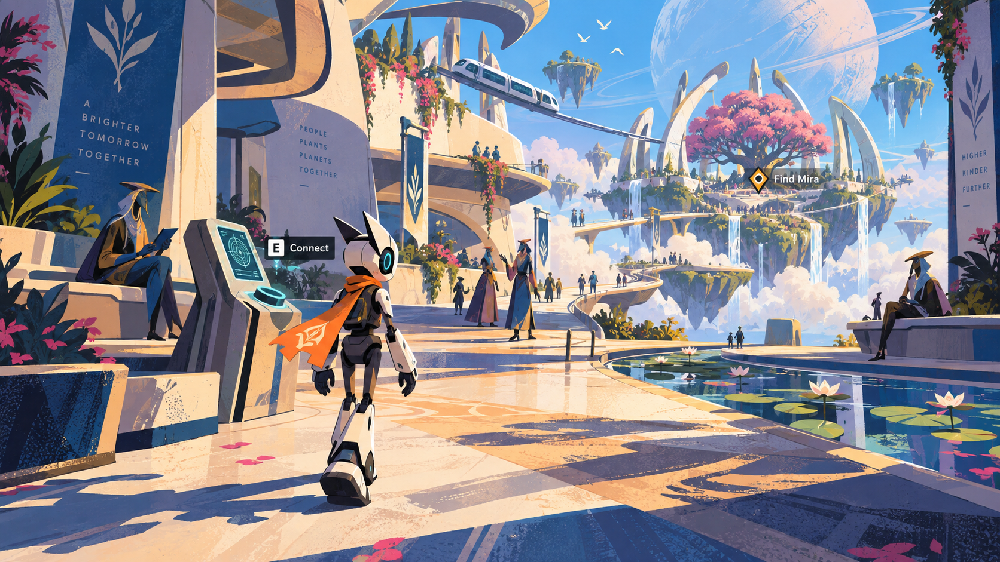

# Accepted visual reference: graphic techno-fantasy utopia

> **Historical (3 Oct 2026).** Written for the earlier PlayCanvas game and its review process. The current game is `experiments/bellweather-arcade`; see "Current direction" in `AGENTS.md`. Ideas here may still help; instructions here are not binding.

User direction, 28 September 2026. The user retained the new graphic rebuild:
"much better, keep this" and specified that the world should feel alive,
expansive, worth exploring and captivating. They describe this as a reference
image and want this art/world direction with realistic lighting and physics.

Preserved reference SHA-256:
`696536D05887422E166E2A6C64DEAE5987F8C74E69012F9ADA6BF53617609F05`.
Generated with built-in image generation; original is
`artifacts/visual-directions-20260928/12-graphic-rebuild.png`.
It is not a screenshot, exact level blueprint, production asset or runtime pass.
The earlier utopian reference 06 remains preserved; the user rejected 10/11 as
filter-like attempts. Do not treat those rejected images as the selected style.

## What the reference establishes

- Far-future technology, fantasy, openness and utopian life; not medieval scenery.
- Expressive graphic shapes, illustrated surface treatment, intentional shadow
  masses and character silhouettes. Inspiration from Spider-Verse is about
  designing and rendering forms, not adding a halftone filter or copying imagery.
- An inhabited world with relationships, purposeful activity and responses to
  player action. More crowds, props or background animation alone do not meet this.
- Expansiveness through connected routes, depth, landmarks, reveals and worthwhile
  discoveries. A promise of exploration needs playable fulfillment within scope;
  not every distant skyline element must become a new level.
- Information and interactions remain situated and readable. The image does not
  approve its decorative slogans, exact NPC/Zip redesign, platform spacing or UI.
- Slight per-level/world-state variation may communicate events through palette,
  contour, texture and lighting while retaining one recognizable art direction
  and stable interaction cues. This is not authorization to build Level 2.

## Realistic light and physical behavior within stylization

**Latest user feedback:** Improvements are acknowledged, but graphics remain
below the desired reference fidelity and need stronger realism, lighting and
physics. This is partial feedback, not a full review or acceptance. Track this
open priority and the earlier directions in [USER-FEEDBACK.md](USER-FEEDBACK.md).

Keep the illustrated shape/material design while making illumination spatially
credible: coherent light direction, contact shadows, occlusion, reflected light
and readable depth. Choose how to represent these in the graphic style; do not
replace it with generic glossy photorealism or assume ray tracing is necessary.

Ground movement, collision, contact, mass and interactive cause/effect in
consistent rules. Floating gardens and advanced transit remain legitimate fantasy;
their support/movement rules must be understandable and reliable. Prefer existing
engine capabilities and demonstrate the affected behavior in actual play. A still
cannot establish lighting performance or physical correctness. Existing motion-
quality/audio review deferrals remain unchanged; this does not excuse broken
controls, collisions or implausible contact.

## Apply to the system and next candidate

Reconcile the existing prologue/world design and asset plan with this direction
before runtime work. The old exact-digest approval is not approval for a changed
design. Preserve learning IDs, saves and evidence. Follow the existing design gate.

Keep the reusable system boundary as a game-specific art-direction specification
with stable rules and bounded variations, separate from learning semantics and
story content. Do not hard-code this palette, floating islands or comic rendering
as the visual identity of every generated game, or add a new framework merely to
record this choice. Reuse suitable assets and rendering capabilities first.

Existing art/world and gameplay critics must test in live play: what attracts
exploration, what that exploration reveals, what inhabitants do/respond to, and
whether light/contact/controls remain credible from changed camera positions.
Compare the candidate to the reference for design intent rather than pixel match.
Technical checks and concept acceptance do not establish an accepted game.
